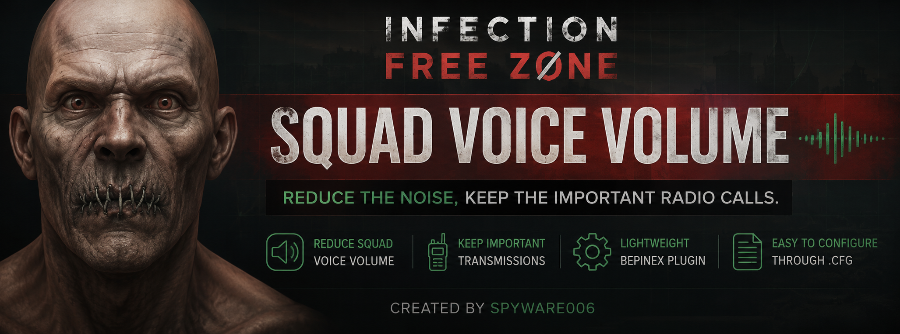

<p align="center">
  
</p>

# Infection Free Zone – Squad Voice Volume

> **Reduce the noise, keep the important radio calls.**

Created by **Spyware006**


## Features

- Reduces squad acknowledgement voice volume.
- Keeps important combat and alert radio transmissions unchanged.
- Lightweight BepInEx + Harmony patch.
- Configurable through a simple `.cfg` file.
- No changes to game files or audio banks.

## Why?

Infection Free Zone has useful radio feedback, but repeated squad acknowledgements such as “Roger”, “On my way”, and similar lines can become overwhelming during longer play sessions.

This mod lowers those repeated squad confirmation voices while preserving important alerts and combat-related transmissions.

## Installation

1. Install **BepInEx 5 x64** for Infection Free Zone.
2. Launch the game once, then close it.
3. Copy **IFZ_SquadVoiceVolume.dll** into:

```
Infection Free Zone/
└── BepInEx/
    └── plugins/
```

4. Launch the game.

On first launch, the plugin automatically creates:

```
Infection Free Zone/
└── BepInEx/
    └── config/
        └── ifz.squadvoicevolume.cfg
```

## Configuration

Open:

```
Infection Free Zone/
└── BepInEx/
    └── config/
        └── ifz.squadvoicevolume.cfg
```

Default values:

```ini
[General]
Enabled = true

[Volume]
ChooseVolume = 0.10
GoVolume = 0.10
AttackVolume = 1.00
BuildingClearVolume = 1.00

[Debug]
DebugLog = false
```

| Setting | Description |
|---|---|
| `ChooseVolume` | Volume when selecting squads |
| `GoVolume` | Volume for movement confirmations |
| `AttackVolume` | Volume for attack acknowledgements |
| `BuildingClearVolume` | Volume for building clear confirmations |
| `DebugLog` | Keep this disabled unless troubleshooting |

`1.00` means original volume.  
`0.10` means 10% of the original volume.  
`0.00` mutes that category.

## Compatibility

- Game: **Infection Free Zone**
- Mod loader: **BepInEx 5.x**
- Platform: **Windows**
- Tested with the Steam version.

## Uninstall

Delete:

```
Infection Free Zone/
└── BepInEx/
    └── plugins/
        └── IFZ_SquadVoiceVolume.dll
```

Optionally delete the config file:

```
Infection Free Zone/
└── BepInEx/
    └── config/
        └── ifz.squadvoicevolume.cfg
```

## License

This project is released under the MIT License.

## Credits

Created by **Spyware006**.
